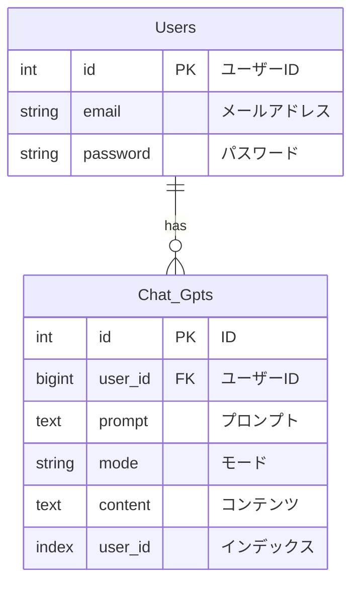

##### Docs/chatgpt_function_db.md
##### DB設計図

 *Chat_Gptsテーブルの`user_id`フィールドは`null: false`です。*
 *`user_id`には検索効率向上のためのインデックスが設定されています。*

```mermaid
erDiagram
    Users ||--o{ Chat_Gpts : has
    Users {
        int id PK "ユーザーID"
        string email "メールアドレス"
        string password "パスワード"
    }
    Chat_Gpts {
        int id PK "ID"
        bigint user_id FK "ユーザーID"
        text prompt "プロンプト"
        string mode "モード"
        text content "コンテンツ"
        index user_id "インデックス"
    }
```
