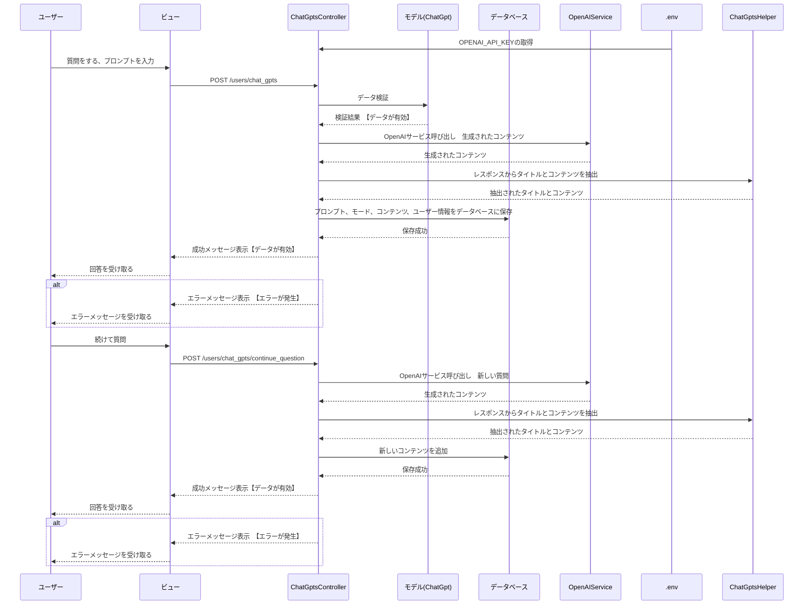

```mermaid
sequenceDiagram
    participant ユーザー
    participant ビュー
    participant ChatGptsController
    participant モデル(ChatGpt)
    participant データベース
    participant OpenAIService
    participant .env
    participant ChatGptsHelper

    .env->>ChatGptsController: OPENAI_API_KEYの取得
    ユーザー->>ビュー: 質問をする、プロンプトを入力
    ビュー->>ChatGptsController: POST /users/chat_gpts
    ChatGptsController->>モデル(ChatGpt): データ検証
    モデル(ChatGpt)-->>ChatGptsController: 検証結果　【データが有効】
    ChatGptsController->>OpenAIService: OpenAIサービス呼び出し　生成されたコンテンツ
    OpenAIService-->>ChatGptsController: 生成されたコンテンツ
    ChatGptsController->>ChatGptsHelper: レスポンスからタイトルとコンテンツを抽出
    ChatGptsHelper-->>ChatGptsController: 抽出されたタイトルとコンテンツ
    ChatGptsController->>データベース: プロンプト、モード、コンテンツ、ユーザー情報をデータベースに保存
    データベース-->>ChatGptsController: 保存成功
    ChatGptsController-->>ビュー: 成功メッセージ表示【データが有効】
    ビュー-->>ユーザー: 回答を受け取る

    alt
        ChatGptsController-->>ビュー: エラーメッセージ表示　【エラーが発生】
        ビュー-->>ユーザー: エラーメッセージを受け取る
    end

    ユーザー->>ビュー: 続けて質問
    ビュー->>ChatGptsController: POST /users/chat_gpts/continue_question
    ChatGptsController->>OpenAIService: OpenAIサービス呼び出し　新しい質問
    OpenAIService-->>ChatGptsController: 生成されたコンテンツ
    ChatGptsController->>ChatGptsHelper: レスポンスからタイトルとコンテンツを抽出
    ChatGptsHelper-->>ChatGptsController: 抽出されたタイトルとコンテンツ
    ChatGptsController->>データベース: 新しいコンテンツを追加
    データベース-->>ChatGptsController: 保存成功
    ChatGptsController-->>ビュー: 成功メッセージ表示【データが有効】
    ビュー-->>ユーザー: 回答を受け取る

    alt
        ChatGptsController-->>ビュー: エラーメッセージ表示　【エラーが発生】
        ビュー-->>ユーザー: エラーメッセージを受け取る
    end
```
