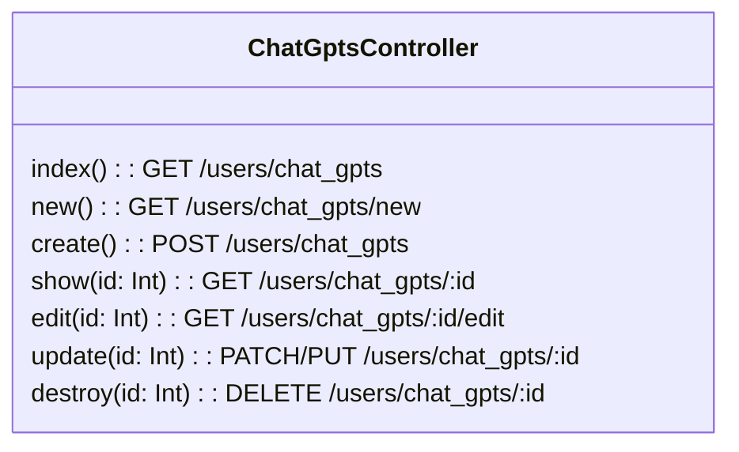

#### Docs/chatgpt_function_url.md
#### url設計

```mermaid
classDiagram
    class ChatGptsController {
        index() : GET /users/chat_gpts
        new() : GET /users/chat_gpts/new
        create() : POST /users/chat_gpts
        show(id: Int) : GET /users/chat_gpts/:id
        edit(id: Int) : GET /users/chat_gpts/:id/edit
        update(id: Int) : PATCH/PUT /users/chat_gpts/:id
        destroy(id: Int) : DELETE /users/chat_gpts/:id
    }
```
